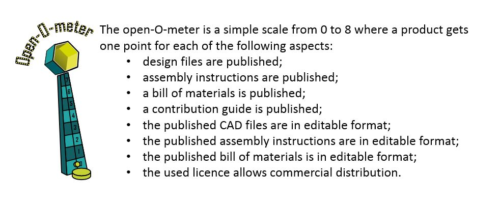

Post writen by Dr. Jérémy Bonvoisin, _Technische Universität Berlin, Institute for Machine-tools and Factory Management, Chair of Industrial Information Technology_

Open-source hardware recently broke out from the sphere of electronics and do-it-yourself 3D-printed gimmicks. There are more and more open source physical and complex products coming up such as tractors, machine tools or even scientific and medical equipment. This means open-source hardware evolved from the field of anonym garage tinkering and now delivers a real alternative to industrial product development processes.

In order to underline this evolution, the research team of the [French-German project “Open!”](https://opensourcedesign.cc/) created the [Observatory of Open Source Hardware](https://opensourcedesign.cc/observatory): an open access and curated directory of complex open-source hardware products. It indexes existing products and provides direct links to their “source code”, that is, to the 3D models of the mechanical parts, to the schematics of the electronic parts and to the firmware embedded in those.

But it does more than that: it also rates the “openness” of the indexed products. Why? Because [it is not always easy to make the difference between a product which is open source and one which is not](http://doi.org/10.5334/joh.7). Despite existing definitions of open source hardware\*, there is to date no simple checklist to define whether a product is open source or not. And this is critical for the emergence of a contribution of a constructive political discourse about open-source hardware, since the tendency to “[openwash](http://parisinnovationreview.com/2017/06/19/open-wash/)” projects is quite frequent those days.

Therefore, the team from “Open!” came out with the concept of the [open-O-meter](https://opensourcedesign.cc/wiki/index.php/Open-O-meter), a simple scale rating the openness of a product from 0 to 8. Depending on which documents are publicly shared, such as CAD files or bills of materials, a product gets more or less points. When a product gets 8 points, congratulations, it complies with best available practices! When it gets zero point, well, it sounds like openwashing... If a product gets between 1 and 7, then it’s a good start!

The Observatory of Open Source Hardware provides an entry point for anybody who wants to deep-dive and learn more about open-source hardware projects. Doing so, it supports exchange of best practice between practitioners: one can see how others do, for example how community members interact, how they share data, how do they “open” their product, and so on. It also helps giving an idea of the magnitude of the phenomenon, as it strives to answer the question: how many open-source hardware products are out there?

There are to date more than 200 products indexed in the database. It is designed so anybody can add their product if they fit with the selection criteria. Any complementary information about an already indexed product is of course welcomed as well.

Have a look at it (and don’t hesitate to contribute): [https://opensourcedesign.cc/observatory/](https://opensourcedesign.cc/observatory/)

_\* in short: “Open source hardware is hardware whose design is made publicly available so that anyone can study, modify, distribute, make, and sell the design or hardware based on that design.” From the Open Source Hardware (OSHW) Statement of Principles 1.0 https://www.oshwa.org/definition/_
