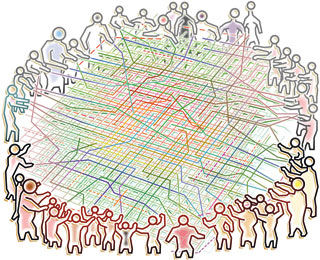
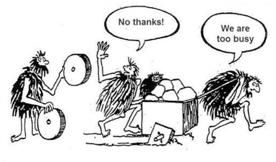

Aujourd’hui, un programmeur peut en quelques centaines de lignes de code créer une application web et mobile qui peut toucher des millions, voire des milliards de personnes connectées à internet.

Comment est-ce possible ? Depuis des années la communauté des programmeurs a construit, autour des protocoles de communication de base TCP/IP (ce que l’on appelle communément l’internet), tous les outils possibles et imaginables permettant à quiconque ayant une idée de se focaliser sur cette idée, ce projet qui lui est propre. Ces ressources sont bien souvent autogérées par les programmeurs qui les utilisent; elles sont accessibles à tous : ce sont des “communs”. Cette infrastructure de “communs numériques” s’est mise en place pas à pas depuis 20 ans, par la construction de protocoles pour travailler ensemble (ex : TCP/IP lui-même, GIT, IRC, etc...), la mise en place de licences pour protéger ce qui est partagé (ex : creative commons), le partage des documentations (ex : readthedocs)...

Aujourd’hui, quand un entrepreneur cherche à developper une idée innovante dans le secteur des mobilités,  les freins sont multiples. Si les communs de l’internet permettent de briser les barrières de l’innovation dans les processus et la distribution de l’idée, il reste que les acteurs historiques semblent relativement attachés à réinventer la roue, avec à la clé un énorme gâchis d’idées mortes-nées et une innovation à la vitesse de l’escargot au galop.

On peut bien sûr continuer ainsi et prétendre que la mobilité c’est différent, qu’il faut du béton, de l’acier, de l’énergie, qu’il y a une dimension et des contraintes physiques et locales. Bref tout cela n’est pas pour nous… Oui le déni est possible. Cela ne vous rappelle-t-il rien ?

**Et si ?**

Et si on ouvrait les infrastructures de transport, à commencer par les flux de données incessants de la mobilité, pour accueillir l’innovation exponentielle ?

Et si les acteurs anciens et nouveaux de la mobilité, prenaient en charge leur avenir, en ce début de XXIème siècle, plein d’incertitude, de prises de consciences nouvelles et donc d’opportunités, et décidaient de collaborer à la création de plateformes et d’infrastructures matérielles et immatérielles communes, comme l’ont fait les programmeurs de la fin du XXème siècle ?

Et si l’on était capable d’enrichir notre culture, en ajoutant une corde à nos arcs, celle où la contribution à des outils et à des entités de transports ouverts serait valorisée financièrement et socialement ?

Si nous investissons et enrichissons cette “infrastructure commune”, il est probable que de nombreuses initiatives émergent sur tout le territoire, capables de résoudre des enjeux de mobilités aujourd’hui trop complexes pour des entrepreneurs souvent seuls, peu équipés et peu financés. Ce coeur “commun” favoriserait le lien entre les entreprises et les multiples acteurs de ce domaine, collectifs citoyens, acteurs publics et privés de toute taille. Permettant alors d’appréhender cette complexité aujourd’hui impossible à traiter individuellement.

Voila ce qui nous motive et nous fait penser que les “biens communs” sont au coeur de la révolution de la mobilité qui s’engouffre dans nos rues et sur nos routes. La [Fabrique des Mobilités](http://lafabriquedesmobilites.fr/articles/la-fabmob-seveille/ "La Fabrique des Mobilités s’éveille") a un rôle particulier à jouer sur cette question, se positionnant par ailleurs elle-même comme un “commun”, nourrie de l’action de nos territoires, de collectivités, d’entreprises, de citoyens impliqués sur ces enjeux de mobilité.

[Pour en savoir plus sur les communs](http://slides.com/unisson/qu-est-ce-qu-un-bien-commun#/)

[Un premier travail de repérage des communs dans le domaine de la mobilité](http://fabmob.encommuns.org)
