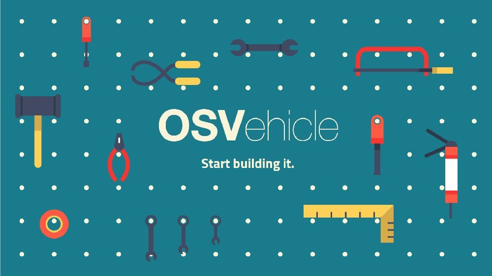

Les communs (re)deviennent à la mode. Les livres et les théories fleurissent. Mais aujourd’hui ils ne parlent pas à la plupart des acteurs industriels. Elinor Ostrom décrit les biens communs comme une **_ressource rivale et non-exclusive,_** ce qui les distingue des biens publics, qui eux, sont non rivaux et non exclusifs. Elle souligne la dualité des communs, à la fois **_ressource exploitée en commun_** et **_régime de droits de propriété_** dérogeant au paradigme de la propriété privée.

Les bases des communs sont également bien détaillées dans ce **[document](http://events.chairefdd.org/wp-content/uploads/2016/04/CAHIER_FDD_69.pdf)** rédigé récemment par H.Verdier et C.Murciano. Nous nous intéressons ici aux « nouveaux biens communs, le plus souvent co-construits ». Aujourd’hui, la co-création (les communs mais également l’open source) participe de mouvements qui vont de l’engagement citoyen, l’économie sociale et solidaire jusqu’à des stratégies industrielles de conquête. Quand une filière industrielle veut passer de l’industrie de la voiture (quelques millions d’unités par an) à l’industrie des services de mobilités (plusieurs dizaines de millions d’unités par jour), une multitude de standard, de service, de partenariat, d’alliance sont à créer, vite.

Le projet Open Source Vehicle

**Inspirer et faire alliance permet d’être plus fort, d’aller plus vite, avec moins de ressource. Dans un monde ([VICA](http://transportsdufutur.ademe.fr/2013/07/light-foot-print-strategy.html?s=VICA)) Vulnérable, Incertain, Complexe et surtout Ambigu, encore faut-il savoir le faire.**

Les communs sont particulièrement intéressants pour mutualiser des développements de ressources. Que restera-t-il si tous les projets en cours dans un domaine échouent ? Rien, sauf les communs. Ces derniers seront les seules ressources activables par de prochains entrepreneurs. La démarche procède d’une **logique à priori** puisque les acteurs s’entendent à mutualiser ou à développer telle ressource pré-compétitives dont ils ont tous besoin maintenant mais qui n’est pas visible ou peu différenciante par les clients. La logique est également contributive.

L’open source procède d’une **logique à posteriori**. Telle ressource est ouverte car elle sera utile « plus tard » sans que l’on sache précisément pourquoi. La valeur d’une donnée ouverte, par exemple, ne peut d’ailleurs être déterminée qu’à posteriori. Des acteurs conçoivent dès le départ une ressource « open » en documentant suffisamment pour que toute personne motivée puisse l’appréhender dans son ensemble et dans son détail pour poursuivre le développement, l’utiliser, la détourner. Une ressource open source se définit par la licence sur laquelle elle s’appuie et qui définit les règles de son utilisation.

La Fabrique souhaite mener en même temps ces 2 processus:

- Indexer ou faire indexer les ressources ouvertes existantes (lien vers le wiki): données, logiciels, matériels. Pourquoi passer à côté, ou refaire quelque chose qui existe déjà ?
- Identifier dans les projets en cours les ressources existantes ou à développer qui sont mutualisables. Pourquoi faire seul quelque chose qui n’est pas compétitif et qui peut être co-créer pour réduire ses dépenses et garantir à plusieurs les évolutions ? Cette ressource-là peut être ouverte ou pas selon la volonté des partenaires qui la développent.

Les 2 processus se complètent pour couvrir un spectre de ressources dont les 2 variables clés sont :

- Le niveau d’ouverture : ouvert à fermé à une communauté
- La logique : à priori (on sait à quoi va servir la ressource, elle est utile maintenant) / à posteriori (l’usage n’est pas connu à l’avance et la ressource peut être détournée de son usage prévu, elle sera utile “plus tard”).

> **Ressources**

**données**

**logiciels**

**matériels**

Open

Open data Hub (voir plus bas)

Communs.lafabriquedesmobilites.fr

Gérées par une communauté (exemples du covoiturage quotidien)

Trace de conducteur

Preuve de covoiturage

Signalétique et Aire covoiturage

Le défi de la Fabrique est de créer les conditions pour qu'émergent des ressources ouvertes. Puis de créer des actifs actionnables par de nombreux entrepreneurs, augmenter ainsi le nombre de nouveau projet, faire travailler des acteurs concurrents homogènes (plusieurs startups d’un même domaine) ou des acteurs hétérogènes (startup, laboratoire et un groupe industriel), et potentiellement créer des standards.

La ressource mise en œuvre par une communauté homogène ou hétérogène est un commun dès lors que ces derniers s’accordent sur des règles de gestion de la ressource pour la maintenir et la faire croitre. La ressource peut éventuellement être totalement ouverte. Dans tous les cas, elle constitue « **l’objet lien »** de la communauté qui se voit progresser à travers elle. L’objet lien rejoint bien sûr le prototype (lire l’article **[Ode au prototype](http://transportsdufutur.ademe.fr/2014/12/ode-au-prototype.html)**) dont la réalisation permet au collectif **d’extérioriser** une idée, de la tester et de mesurer l’écart entre l’idée et les usages.

Récemment Henri Verdier et Charles Murciano présentaient les communs numériques comme des alternatives crédibles aux plateformes. « _Nous soutenons que cette logique autorise une nouvelle forme d’action publique alliée à la multitude, en promouvant et en encadrant les communs, la puissance publique pourrait s’armer contre l’hégémonie croissante de grandes plateformes monopolistiques dont les logiques s’opposent de plus en plus à celles des Etats_ ». La Fabrique se constitue ainsi comme une machine à communs, à ressources ouvertes. Appelons cela des objets liens : plus ou moins ouvert selon la ressource et la communauté associée. En nommant « objet lien », on ne se réfère plus à la ressource mais à son rôle, celui de relier. Comme le ballon révèle les talents des joueurs, l’objet lien engage les parties prenantes à agir « à travers lui ». A la fois pour le développer et le faire grandir (dans le cas d’objet lien plus complexe), mais aussi pour développer des compétences spécifiques pour travailler ensemble. En contact avec tous les acteurs dont les utilisateurs, avec toutes les phases de vie, l’objet lien sera en friction et ces frictions seront parties intégrantes de l’objet lien. L’objet lien devient **un révélateur et un traceur des usages**. Il s'en imprègne. Les itérations concernant les usages, les détournements, les incidents, les incompréhensions feront partie des nombreuses interactions.

La seconde partie de l'article portera sur les **stratégies industrielles qui utilisent les objets liens.**
