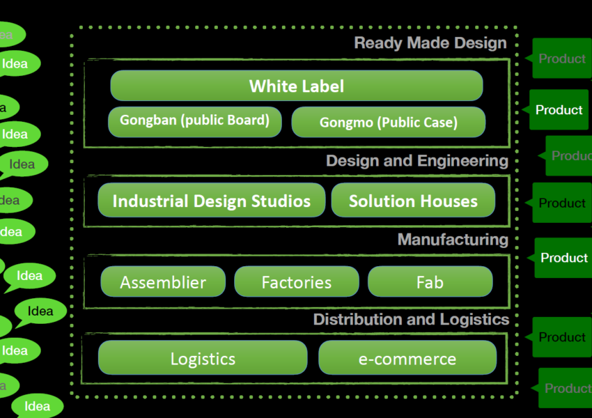

5 days spend in the electronic workshop of the world. Let's try to understand the culture of entrepreneurs and those who accompany them by choosing an Open Innovation Lab : [**SZOIL**](http://lafabriquedesmobilites.fr/articles/innovation/fabmob-trip-in-shenzhen/).

# 1\. From Complexity to Commodity

At first they were considered as our workers, simple subcontractors. Then they applied the reverse-engineering and thoroughly analyzed what they produce. While the silicon valley produces complex closed objects, Shenzhen has totally cut the complexity of electronic objects into modules, components. These are new screw and bolt: commodities. Since intellectual property is just a concept, entrepreneurs place themselves in a permanent competition to combine these commodities and develop new products. Prototyping is almost immediate, a few days are enough. If first customers buy, the scaling is done in a few weeks. Electronic markets and factories become platforms and only the conquest of a large market protects a product. This is amplified by e-commerce and logistics chains with an incredible capacity.

For **David Li** ([**presentation**](https://cloud.fabmob.io/s/2MWBAgTqMyJLHzE#pdfviewer)), things are literally "on the street". Shenzhen creates the technical conveniences that must now be re-given meaning, the "narrative". For David Li, this narrative will come from local communities - he also speaks about [**cooperatives**](https://cloud.fabmob.io/s/WQBCazMXbBbPNdr) \- who will be able to address a niche market, master the negative sides of technologies since each community will set the rules and uses. By relying on cheap commodities, an infinite combination can emerge.

For example, this electric car transmission coming from **LSEV** will be available to design new vehicles :

 

**For [FabMob](https://cloud.fabmob.io/s/YFjK6CNYbnBRTNS), instead of providing _post-it_ we will provide a list of existing low cost commodities in order to prototype, test, validate quickly your main hypothesis. It is a question of continuing the development of a multitude of usable and pre-qualified resources (as open and documented as possible) to cover a multitude of domains. These resources are intended to inspire, tell our narratives and be usable by a maximum of entrepreneurs.**

# 2\. From Idea to Products in few weeks

Shenzhen now offers almost all smartphone white label products, connected padlocks and other electric scooters. In addition to the commodities, it becomes possible to redesign a new product based on the existing. Companies like **LKK** ([**presentation**](https://cloud.fabmob.io/s/P5BLJK6KcKDoLHw)) offer the complete package: design, prototype, experimentation, manufacturing, e-commerce and logistics. Shenzhen seems to have succeeded in industrializing the exploration of "niches". Niches can be smartphones market for Kenya ! Based on existing low cost chinese smartphone, Africans entrepreneurs redesign the product to fit their needs and then develop a production site in Kenya.

The [**innovative dilemma**](https://www.christenseninstitute.org/publications/driving-disruption/) applies perfectly in China: when the real need of consumers is "over-surpassed" by the actors in place, newcomers come with cheaper, simpler products.

**For FabMob, speed is the key to turning a market faster than thousands of other competitors. China places its contractors in conditions where they can not do otherwise. France can not position itself directly on this criterion, nor is Europe unfortunately. It seems necessary now to control access to these commodities, the art of hacking and combinatorics and to couple this at least one of the two parameters: new "technologies" not mastered by China (if any ?) AND / OR the involvement of communities to cover a multitude of "tailor-made" niches.**

**Open source is really a relative way ... Shenzhen demonstrates that access to organized amenities is an essential advantage. It is good to develop the art of DIY, hacking, the use of millions of available resources, there "on the street". This entrepreneurial capacity is the basis of the realization. The conveniences and the ability to combine them bring unprecedented speed and iteration capability as well as an entry barrier that tends to zero.**
